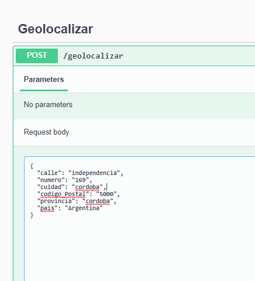
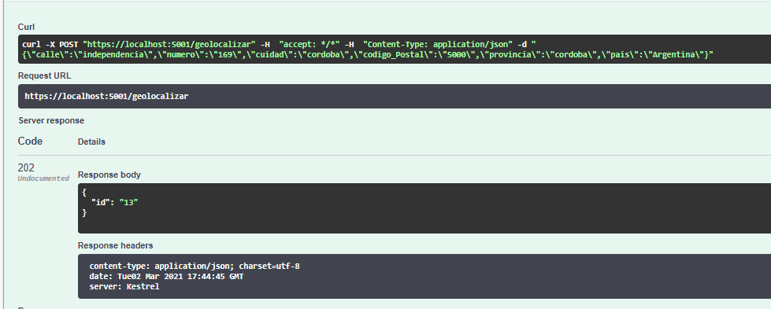
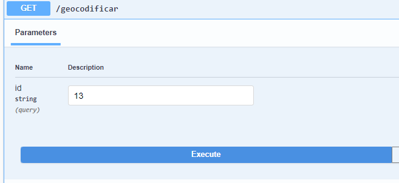
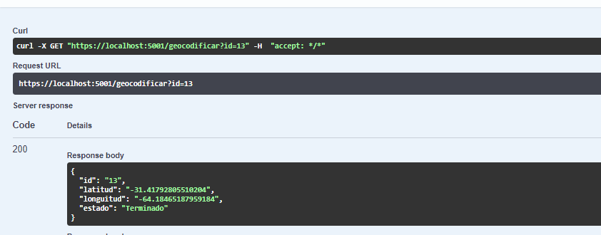

# Prueba técnica Andreani
 
Antes que nada, pido disculpas por no haber podido dockerizar los proyectos, mi maquina no es muy compatible con docker

>El archivo docker-compose.yml solo contiene la imagen de apache kafka 

Por otro lado se pudo hacer el desarrollo pedido utilizando como tecnologías de base de datos SQL server y Apache Kafka como bus de mensajería.
 
Dentro de cada proyecto se encuentra los appsettings, en caso de querer correr se debe modificar la ConnectionString y la URL de Kafka
 
Adjunto algunas imágenes que obtuve probando.
 
## pruebas
Enviamos a geolocalizar el siguiente json
 
 

 
Obtenemos la siguiente respuesta
 

 
Internamente se comunican por kafka los dos micro servicios y se consulta a la API de OpenStreetMap utilizando Refit.
 
Podemos ver si se proceso la petición consultando a la api de Geocodificar
 

 
y obtenemos el siguiente resultado.
 

